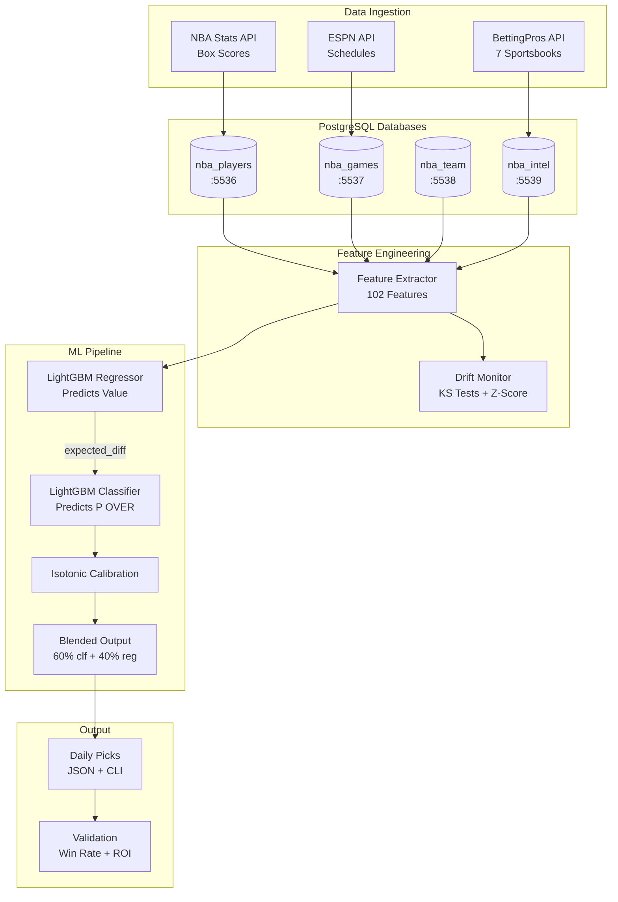

# NBA Player Props ML System


End-to-end machine learning pipeline for NBA player prop betting. Ingests live odds from 7 sportsbooks, extracts 102 features per prop, and generates calibrated predictions using stacked LightGBM architectures.

## What This Project Demonstrates

- **ML Pipeline Design**: Feature extraction, model training, probability calibration
- **Data Engineering**: Multi-source ingestion, PostgreSQL schema design, automated pipelines
- **Production Thinking**: Validation methodology, drift monitoring, CI/CD

## Results (January 2026)

### Live Performance

| Metric | Value | Sample | Notes |
|--------|-------|--------|-------|
| **Win Rate** | 63.0% | 46 bets | Jan 23-29, 2026 (7 days, filtered picks) |
| **ROI** | +19.8% | 46 bets | At standard -110 odds |
| **Units Profit** | +14.81u | 7 days | ~6.6 picks/day average |

### By Market

| Market | Bets | Win Rate | ROI |
|--------|------|----------|-----|
| POINTS | 23 | 65.2% | +24.3% |
| REBOUNDS | 23 | 60.9% | +15.4% |

**Active Markets**: POINTS & REBOUNDS only (ASSISTS/THREES disabled due to poor AUC)

**Important caveats:**
- Results from filtered picks only (edge thresholds, spread filters)
- Past performance does not guarantee future results
- Markets adapt; edges can decay over time

### Methodology

```
Training:   Oct 2023 - Apr 2025 (~24,000 props per market)
Validation: Rolling 7-day window with temporal split (no future data leakage)
```

---

## Model Architecture

### Production Models (Nov 6, 2025)

| Market | Features | R² | AUC | Architecture | Status |
|--------|----------|-----|-----|--------------|--------|
| **POINTS** | 102 | 0.410 | 0.767 | Two-head stacked | ✅ DEPLOYED |
| **REBOUNDS** | 102 | 0.403 | 0.749 | Two-head stacked | ✅ DEPLOYED |
| **ASSISTS** | 102 | 0.058 | 0.587 | Two-head stacked | ⚠️ DISABLED |
| **THREES** | 102 | 0.178 | 0.713 | Two-head stacked | ⚠️ DISABLED |

### Feature Breakdown

**XL Model (102 features) - CURRENT PRODUCTION:**
```
Player Features (78):
├── Rolling stats with EMA: L3/L5/L10/L20 for 9 stats
├── Points, rebounds, assists, threes, steals, blocks, turnovers, minutes, FG%
├── Team context: pace, offensive/defensive ratings, projected possessions
├── Advanced: rest days, B2B, travel distance, altitude, season phase
├── Usage: starter flag, bench points ratio, position, avg teammate usage
└── Recent performance: points per minute L5, days since last 30pt game

Book Disagreement (20):
├── Line variance: spread, consensus, std dev, num books, coeff of variation
├── Per-book deviations: DraftKings, FanDuel, BetMGM, Caesars, BetRivers, ESPNBet
├── Softest/hardest book IDs, line spread percentile
└── Softest vs consensus, hardest vs consensus, min/max line

Computed (4):
├── is_home: Player home/away status (from game logs)
├── line: Sportsbook prop line
├── opponent_team: Opponent team code
└── expected_diff: Regressor prediction - line (added by classifier head)
```

**V3 Model (166 features) - Available but not deployed:**
```
All XL features (102) plus:
├── Head-to-Head History (36): H2H averages per stat, L3/L5/L10/L20 windows
├── Prop History (12): Hit rates, Bayesian confidence, streaks
└── Vegas & BettingPros (16): Vegas total/spread, projections, ratings
```

### Two-Head Stacked Architecture

```
┌─────────────────────────────────────────────────────────────────────────┐
│                      TWO-HEAD STACKED MODEL                             │
│                                                                         │
│    ┌────────────────────┐        ┌────────────────────┐                │
│    │  HEAD 1: Regressor │        │  HEAD 2: Classifier │                │
│    │  (LightGBM)        │        │  (LightGBM)         │                │
│    │                    │        │                     │                │
│    │  Input: 102 feat   │───────▶│  Input: 102 feat    │                │
│    │  Output: predicted │  diff  │  + expected_diff    │                │
│    │          value     │        │  Output: P(OVER)    │                │
│    └────────────────────┘        └─────────┬──────────┘                │
│                                            │                            │
│                                            ▼                            │
│                              ┌────────────────────┐                     │
│                              │  Isotonic          │                     │
│                              │  Calibration       │                     │
│                              └─────────┬──────────┘                     │
│                                        │                                │
│                                        ▼                                │
│                    Blended: 60% classifier + 40% residual               │
└─────────────────────────────────────────────────────────────────────────┘
```

---

## System Architecture



---

## File Map

```
nba/
├── betting_xl/
│   ├── xl_predictor.py              # Model loading + inference
│   ├── line_optimizer.py            # Bet filtering logic
│   ├── validate_predictions.py      # Results validation (all systems)
│   ├── validate_xl_models.py        # Historical model backtesting
│   ├── predictions/                 # Daily picks output
│   └── fetchers/                    # Data collection (7 books)
│       ├── fetch_bettingpros.py     # Main odds fetcher
│       ├── fetch_cheatsheet.py      # BettingPros projections
│       ├── fetch_pick6_live.py      # Odds API integration
│       └── fetch_vegas_lines.py     # Vegas totals/spreads
│
├── models/
│   ├── saved_xl/                    # Production models
│   │   ├── {market}_xl_*.pkl        # 102-feature XL models (CURRENT PRODUCTION)
│   │   ├── {market}_v3_*.pkl        # 166-feature V3 models (available, not deployed)
│   │   └── {market}_matchup_*.pkl   # 44-feature matchup add-on models
│   ├── train_market.py              # Model training
│   └── model_cards/                 # Model documentation
│
├── features/
│   ├── extract_live_features_xl.py  # 102-feature extraction (XL production)
│   ├── extractors/                  # Modular feature extractors
│   │   ├── book_features.py         # Book disagreement features
│   │   ├── h2h_features.py          # Head-to-head features
│   │   └── prop_history_features.py # Prop history features
│   └── datasets/                    # Training data
│
├── core/
│   ├── schemas.py                   # Pydantic validation
│   ├── exceptions.py                # Custom exception hierarchy
│   ├── drift_detection.py           # Feature drift monitoring
│   ├── drift_service.py             # Production drift service
│   ├── experiment_tracking.py       # MLflow integration
│   └── logging_config.py            # Structured logging
│
├── config/
│   ├── thresholds.py                # Betting thresholds config
│   ├── constants.py                 # Shared constants
│   └── database.py                  # Database connection config
│
└── nba-predictions.sh               # Pipeline orchestrator
```

---

## Quick Start

### Prerequisites
- Python 3.10+
- Docker (for PostgreSQL databases)
- BettingPros API key

### Setup

```bash
# Clone and configure
git clone https://github.com/untitled114/Sport-suite.git
cd Sport-suite
cp .env.example .env  # Add your credentials

# Start databases
cd docker && docker-compose up -d

# Install
pip install -e ".[dev]"

# Run full pipeline (data collection + predictions)
./nba/nba-predictions.sh full

# Quick refresh (line movements + regenerate predictions)
./nba/nba-predictions.sh refresh
```

### Validate Results

```bash
# Using the CLI (recommended)
./nba/nba-predictions.sh validate           # Yesterday's results
./nba/nba-predictions.sh validate --7d      # Last 7 days
./nba/nba-predictions.sh validate --30d     # Last 30 days

# Show current picks
./nba/nba-predictions.sh picks
```

---

## Technical Details

### Training Metrics (Nov 6, 2025)

**POINTS Market (XL - 102 features):**
| Metric | Train | Test |
|--------|-------|------|
| RMSE | 6.13 | 6.84 |
| MAE | - | 5.23 |
| R² | - | 0.410 |
| AUC | 0.96 | 0.767 |

**REBOUNDS Market (XL - 102 features):**
| Metric | Train | Test |
|--------|-------|------|
| RMSE | 2.34 | 2.71 |
| MAE | - | 2.01 |
| R² | - | 0.403 |
| AUC | 0.95 | 0.749 |

### Data Sources

- **BettingPros API**: 7 sportsbooks (DraftKings, FanDuel, BetMGM, Caesars, BetRivers, ESPNBet, Underdog)
- **ESPN API**: Game schedules, matchup data (fallback for BettingPros)
- **NBA Stats**: Box scores, player game logs

---

## Engineering Practices

### Testing & CI/CD
- **512 tests** with pytest (unit + integration), **95.94% coverage**
- **GitHub Actions CI/CD** - Automated linting, testing, type checking on every push
- **Pre-commit hooks** - black, isort, flake8, bandit for code quality

### Data Quality & Observability
- **Feature drift detection** - KS tests and z-score monitoring for model degradation
- **Pydantic schemas** - Runtime data validation for all pipeline inputs
- **Custom exception hierarchy** - Granular error handling (`PickleLoadError`, `CalibrationError`, etc.)

### Architecture
- **Centralized configuration** - Frozen dataclasses for thresholds, no magic numbers
- **Modular feature extractors** - Dependency injection, single responsibility
- **Airflow DAGs** - `nba_full_pipeline` and `nba_refresh_pipeline` for orchestration

### Documentation
- **Architecture Decision Records** (ADRs) in `docs/adr/`
- **Model cards** with SHAP feature importance plots
- **Conventional commits** for clear git history

---

## License

MIT License

---

**Author**: [@untitled114](https://github.com/untitled114)
