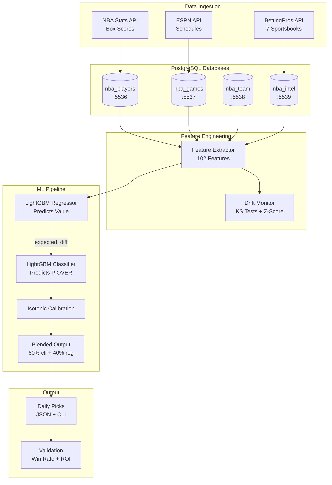

# NBA Player Props ML System


End-to-end machine learning pipeline for NBA player prop betting. Ingests live odds from 7 sportsbooks, extracts features per prop (102 for XL, 136 for V3), and generates calibrated predictions using stacked LightGBM architectures. Both XL and V3 models run in parallel in production.

## What This Project Demonstrates

- **ML Pipeline Design**: Feature extraction, model training, probability calibration
- **Data Engineering**: Multi-source ingestion, PostgreSQL schema design, automated pipelines
- **Production Thinking**: Validation methodology, drift monitoring, CI/CD

## Results (January 2026)

### Live Performance

| Metric | Value | Sample | Notes |
|--------|-------|--------|-------|
| **Win Rate** | 63.0% | 46 bets | Jan 23-29, 2026 (7 days, filtered picks) |
| **ROI** | +19.8% | 46 bets | At standard -110 odds |
| **Units Profit** | +14.81u | 7 days | ~6.6 picks/day average |

### By Market

| Market | Bets | Win Rate | ROI |
|--------|------|----------|-----|
| POINTS | 23 | 65.2% | +24.3% |
| REBOUNDS | 23 | 60.9% | +15.4% |

**Active Markets**: POINTS & REBOUNDS only (ASSISTS/THREES disabled due to poor AUC)

**Important caveats:**
- Results from filtered picks only (edge thresholds, spread filters)
- Past performance does not guarantee future results
- Markets adapt; edges can decay over time

### Methodology

```
Training:   Oct 2023 - Apr 2025 (~24,000 props per market)
Validation: Rolling 7-day window with temporal split (no future data leakage)
```

---

## Model Architecture

### Production Models

Both XL and V3 models run in parallel in production. Picks include `model_version: "xl"` or `"v3"`.

| Model | Market | Features | R² | AUC | Trained | Status |
|-------|--------|----------|-----|-----|---------|--------|
| **XL** | POINTS | 102 | 0.410 | 0.767 | Dec 2025 | ✅ DEPLOYED |
| **XL** | REBOUNDS | 102 | 0.403 | 0.749 | Dec 2025 | ✅ DEPLOYED |
| **V3** | POINTS | 136 | 0.548 | 0.740 | Feb 3, 2026 | ✅ DEPLOYED |
| **V3** | REBOUNDS | 136 | 0.530 | 0.739 | Feb 3, 2026 | ✅ DEPLOYED |
| - | ASSISTS | 102 | 0.058 | 0.587 | Dec 2025 | ⚠️ DISABLED |
| - | THREES | 102 | 0.178 | 0.713 | Dec 2025 | ⚠️ DISABLED |

### Feature Breakdown

**XL Model (102 features):**
```
Player Features (78):
├── Rolling stats with EMA: L3/L5/L10/L20 for 9 stats
├── Points, rebounds, assists, threes, steals, blocks, turnovers, minutes, FG%
├── Team context: pace, offensive/defensive ratings, projected possessions
├── Advanced: rest days, B2B, travel distance, altitude, season phase
├── Usage: starter flag, bench points ratio, position, avg teammate usage
└── Recent performance: points per minute L5, days since last 30pt game

Book Disagreement (20):
├── Line variance: spread, consensus, std dev, num books, coeff of variation
├── Per-book deviations: DraftKings, FanDuel, BetMGM, Caesars, BetRivers, ESPNBet
├── Softest/hardest book IDs, line spread percentile
└── Softest vs consensus, hardest vs consensus, min/max line

Computed (4):
├── is_home: Player home/away status (from game logs)
├── line: Sportsbook prop line
├── opponent_team: Opponent team code
└── expected_diff: Regressor prediction - line (added by classifier head)
```

**V3 Model (136 features) - DEPLOYED Feb 3, 2026:**
```
All XL features (102) plus 34 additional features:

Season/Temporal (6):
├── days_into_season, season_phase_encoded
└── is_early_season, is_mid_season, is_late_season, is_playoffs

Volatility (8):
├── {stat}_std_L5, {stat}_std_L10, minutes_std_L5, minutes_std_L10, fga_std_L5
├── {stat}_trend_ratio, minutes_trend_ratio
└── usage_volatility_score

H2H Decay (5):
├── h2h_decayed_avg_{stat}, h2h_trend_{stat}
├── h2h_recency_adjusted_{stat}, h2h_time_decay_factor
└── h2h_reliability

Line/Book (9):
├── line_std, softest_book_hit_rate, softest_book_soft_rate
├── softest_book_line_bias, line_source_reliability
├── line_delta, line_movement_std, consensus_strength
└── snapshot_count, hours_tracked

Matchup/Other (6):
├── efficiency_vs_context, game_velocity, season_phase
├── resistance_adjusted_L3, volume_proxy
└── momentum_short_term
```

### Two-Head Stacked Architecture

```
┌─────────────────────────────────────────────────────────────────────────┐
│                      TWO-HEAD STACKED MODEL                             │
│                                                                         │
│    ┌────────────────────┐        ┌────────────────────┐                │
│    │  HEAD 1: Regressor │        │  HEAD 2: Classifier │                │
│    │  (LightGBM)        │        │  (LightGBM)         │                │
│    │                    │        │                     │                │
│    │  Input: 102 feat   │───────▶│  Input: 102 feat    │                │
│    │  Output: predicted │  diff  │  + expected_diff    │                │
│    │          value     │        │  Output: P(OVER)    │                │
│    └────────────────────┘        └─────────┬──────────┘                │
│                                            │                            │
│                                            ▼                            │
│                              ┌────────────────────┐                     │
│                              │  Isotonic          │                     │
│                              │  Calibration       │                     │
│                              └─────────┬──────────┘                     │
│                                        │                                │
│                                        ▼                                │
│                    Blended: 60% classifier + 40% residual               │
└─────────────────────────────────────────────────────────────────────────┘
```

---

## System Architecture



---

## File Map

```
nba/
├── betting_xl/
│   ├── xl_predictor.py              # Model loading + inference
│   ├── line_optimizer.py            # Bet filtering logic
│   ├── validate_predictions.py      # Results validation (all systems)
│   ├── validate_xl_models.py        # Historical model backtesting
│   ├── predictions/                 # Daily picks output
│   └── fetchers/                    # Data collection (7 books)
│       ├── fetch_bettingpros.py     # Main odds fetcher
│       ├── fetch_cheatsheet.py      # BettingPros projections
│       ├── fetch_pick6_live.py      # Odds API integration
│       └── fetch_vegas_lines.py     # Vegas totals/spreads
│
├── models/
│   ├── saved_xl/                    # Production models
│   │   ├── {market}_xl_*.pkl        # 102-feature XL models (DEPLOYED)
│   │   ├── {market}_v3_*.pkl        # 136-feature V3 models (DEPLOYED Feb 3, 2026)
│   │   └── {market}_matchup_*.pkl   # 44-feature matchup add-on models
│   ├── train_market.py              # Model training
│   └── model_cards/                 # Model documentation
│
├── features/
│   ├── extract_live_features_xl.py  # Feature extraction (XL: 102, V3: 136)
│   ├── extractors/                  # Modular feature extractors
│   │   ├── book_features.py         # Book disagreement features
│   │   ├── h2h_features.py          # Head-to-head features
│   │   └── prop_history_features.py # Prop history features
│   └── datasets/                    # Training data
│
├── core/
│   ├── schemas.py                   # Pydantic validation
│   ├── exceptions.py                # Custom exception hierarchy
│   ├── drift_detection.py           # Feature drift monitoring
│   ├── drift_service.py             # Production drift service
│   ├── experiment_tracking.py       # MLflow integration
│   └── logging_config.py            # Structured logging
│
├── config/
│   ├── thresholds.py                # Betting thresholds config
│   ├── constants.py                 # Shared constants
│   └── database.py                  # Database connection config
│
└── nba-predictions.sh               # Pipeline orchestrator

dbt/                                  # Feature engineering (SQL)
├── models/
│   ├── staging/                     # Raw data cleaning
│   ├── intermediate/                # Rolling stats, book spreads
│   └── marts/                       # ML-ready feature vectors
└── dbt_project.yml

notebooks/
└── model_retraining_guide.ipynb     # Retraining workflow + SHAP analysis
```

---

## Quick Start

### Prerequisites
- Python 3.10+
- Docker (for PostgreSQL databases)
- BettingPros API key

### Setup

```bash
# Clone and configure
git clone https://github.com/untitled114/Sport-suite.git
cd Sport-suite

# 1. Create environment file with your credentials
cp .env.example .env
nano .env  # Set DB_PASSWORD, BETTINGPROS_API_KEY, ODDS_API_KEY

# 2. Load environment variables
source .env
export DB_USER DB_PASSWORD BETTINGPROS_API_KEY ODDS_API_KEY

# 3. Install and start (using Makefile)
make install
make db-up

# Or manually:
pip install -e ".[dev]"
cd docker && docker-compose up -d
```

> **Important**: See [docs/SETUP.md](docs/SETUP.md) for complete setup instructions,
> including production deployment on Hetzner servers and systemd configuration.

### Common Commands

```bash
make run          # Full pipeline (data + predictions)
make refresh      # Quick refresh (line movements only)
make picks        # Show current picks
make validate     # Validate yesterday's results
make validate-7d  # Validate last 7 days

make test         # Run tests with coverage
make lint         # Run linters
make train        # Retrain models (with data validation)

make dbt-run      # Run dbt models
make dbt-test     # Run dbt tests
```

Run `make help` for all available commands.

---

## Technical Details

### Training Metrics

**XL Models (102 features) - Dec 2025:**

| Market | RMSE (Test) | MAE | R² | AUC |
|--------|-------------|-----|-----|-----|
| POINTS | 6.84 | 5.23 | 0.410 | 0.767 |
| REBOUNDS | 2.71 | 2.01 | 0.403 | 0.749 |

**V3 Models (136 features) - Feb 3, 2026:**

| Market | RMSE (Test) | MAE | R² | AUC |
|--------|-------------|-----|-----|-----|
| POINTS | 6.01 | 4.51 | 0.548 | 0.740 |
| REBOUNDS | 2.36 | 1.78 | 0.530 | 0.739 |

Note: V3 models show improved R² (regressor accuracy) but slightly lower AUC (classifier accuracy). Both model versions run in parallel; performance is monitored to determine optimal ensemble strategy.

### Data Sources

- **BettingPros API**: 7 sportsbooks (DraftKings, FanDuel, BetMGM, Caesars, BetRivers, ESPNBet, Underdog)
- **ESPN API**: Game schedules, matchup data (fallback for BettingPros)
- **NBA Stats**: Box scores, player game logs

---

## Engineering Practices

### Testing & CI/CD
- **pytest** with 70%+ coverage threshold (unit + integration tests)
- **GitHub Actions CI/CD**:
  - **Lint**: black, isort, flake8, mypy on every push
  - **Tests**: pytest with coverage on Python 3.10, 3.11
  - **Security**: Gitleaks secret scanning, Trivy vulnerability scanning, Bandit code analysis
  - **Deploy**: Auto-deploy to production on push to main (requires GitHub Secrets)
- **Pre-commit hooks** - black, isort, flake8, gitleaks, bandit for code quality

### Data Quality & Observability
- **Pre-training validation** - Great Expectations-style checks before model training
- **Feature drift detection** - KS tests and z-score monitoring for model degradation
- **Pydantic schemas** - Runtime data validation for all pipeline inputs
- **Custom exception hierarchy** - Granular error handling (`PickleLoadError`, `CalibrationError`, etc.)

### Architecture
- **Centralized configuration** - Frozen dataclasses for thresholds, no magic numbers
- **Modular feature extractors** - Dependency injection, single responsibility
- **Airflow DAGs** - `nba_full_pipeline` and `nba_refresh_pipeline` for orchestration
- **dbt transformations** - SQL-based feature engineering with tests and docs

### Documentation
- **Architecture Decision Records** (ADRs) in `docs/adr/`
- **Model cards** with SHAP feature importance plots
- **Conventional commits** for clear git history

---

## License

MIT License

---

**Author**: [@untitled114](https://github.com/untitled114)
