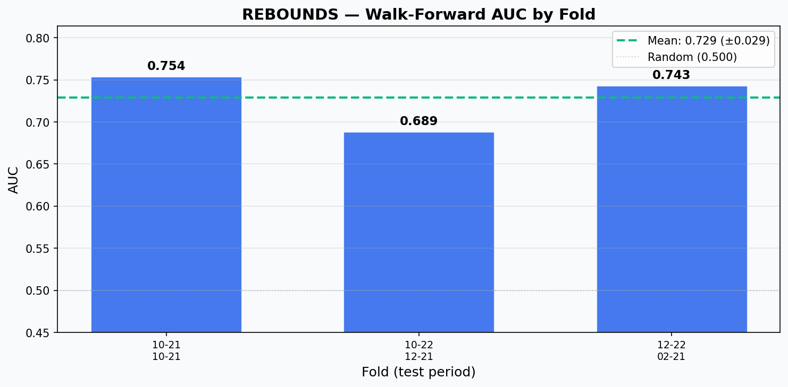
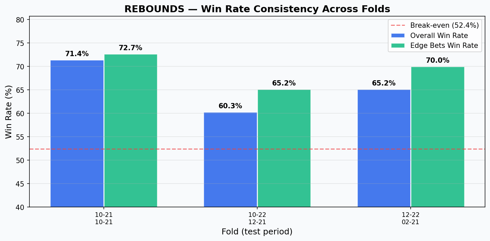
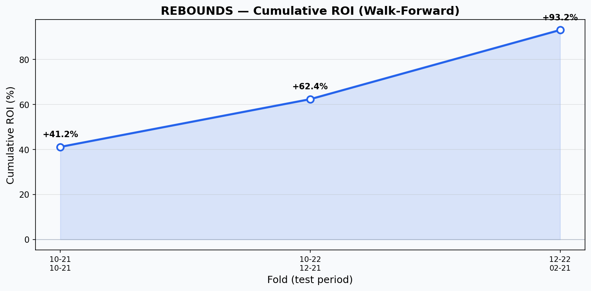

# Model Card: NBA REBOUNDS Predictor

## Model Details

| Property | Value |
|----------|-------|
| **Model Name** | REBOUNDS V5 Stacked Two-Head |
| **Version** | 5.0.0 |
| **Trained Date** | 2026-03-24 |
| **Architecture** | Stacked Two-Head (Regressor + Classifier) |
| **Framework** | LightGBM 4.x |
| **Features** | 134 |
| **Production Status** | DEPLOYED |

## Model Architecture

```
                        INPUT: 134 Features
  Player EMAs (32) + Team (6) + H2H (12) + Book (18) + BP (8) + More

                              |
                              v
              HEAD 1: LightGBM Regressor
              lr=0.05, ~90 trees (early-stopped)
              Output: predicted stat value (e.g., 8.7 rebounds)
                              |
                              v
                   expected_diff (OOF)
                   = prediction - line
                   (5-fold CV + noise injection)
                              |
                              v
              HEAD 2: LightGBM Classifier
              lr=0.05, ~107 trees, ALL features + expected_diff
              Output: P(actual > line)
                              |
                              v
              Platt Scaling Calibration
              LogisticRegression on 15% holdout
              Applied: Brier improved by 0.0006
```

## Training Data

| Property | Value |
|----------|-------|
| **Source** | BettingPros historical props |
| **Samples** | 25,787 |
| **Date Range** | Oct 2024 - Mar 2026 |
| **Train/Test Split** | 70/30 temporal split (no shuffle) |
| **Builder** | `build_xl_training_dataset_batched.py` |

## Performance Metrics

### Single-Split Training
| Metric | Train | Test |
|--------|-------|------|
| Regressor RMSE | 2.16 | 2.25 |
| Regressor R2 | - | 0.534 |
| Classifier AUC | - | **0.729** |
| Classifier Accuracy | 70.5% | 66.6% |
| Brier Score | - | 0.211 |
| Log Loss | - | 0.611 |

### Walk-Forward Validation (3 folds, 2-month test windows)

| Fold | Train Period | Test Period | AUC | Win Rate | Edge WR | ROI |
|------|-------------|-------------|-----|----------|---------|-----|
| 1 | 2024-10-22 to 2025-04-13 | 2025-10-21 to 2025-10-21 | 0.754 | 71.4% | 72.7% | — |
| 2 | 2024-10-22 to 2025-10-21 | 2025-10-22 to 2025-12-21 | 0.689 | 60.3% | 65.2% | — |
| 3 | 2024-10-22 to 2025-12-21 | 2025-12-22 to 2026-02-21 | 0.743 | 65.2% | 70.0% | — |

**Mean AUC: 0.729 (+/- 0.029) | Win Rate: 65.6% | Edge WR: 69.3% | ROI: +25.8%**





### Position Segments
| Player Segment | Notes |
|----------------|-------|
| Centers (>8 RPG) | Most predictable — positional advantage |
| Power Forwards (5-8 RPG) | Strong performance |
| Guards/Wings (<5 RPG) | Higher variance |

## Top Features

### Regressor (Top 10)
| Rank | Feature | Splits |
|------|---------|--------|
| 1 | h2h_std_rebounds | 254 |
| 2 | h2h_L3_rebounds | 187 |
| 3 | h2h_L5_rebounds | 152 |
| 4 | opp_positional_def | 128 |
| 5 | h2h_home_avg_rebounds | 115 |
| 6 | prop_hit_rate_context | 114 |
| 7 | h2h_trend_rebounds | 108 |
| 8 | h2h_away_avg_rebounds | 103 |
| 9 | prop_line_vs_season_avg | 99 |
| 10 | line | 91 |

### Classifier (Top 10)
| Rank | Feature | Splits |
|------|---------|--------|
| 1 | expected_diff | 147 |
| 2 | h2h_std_rebounds | 109 |
| 3 | opp_positional_def | 99 |
| 4 | prop_hit_rate_context | 95 |
| 5 | h2h_away_avg_rebounds | 92 |
| 6 | h2h_home_avg_rebounds | 70 |
| 7 | h2h_trend_rebounds | 62 |
| 8 | momentum_short_term | 62 |
| 9 | bp_hit_rate_season | 59 |
| 10 | hours_tracked | 49 |

## Feature Categories (134 total)

| Category | Count | Examples |
|----------|-------|----------|
| Player Rolling Stats (all stats) | 38 | ema_points/rebounds/assists/threes/steals/blocks/turnovers/minutes L3-L20 |
| Shooting & Advanced | 8 | fg_pct L3-L20, ft_rate_L10, true_shooting_L10, plus_minus |
| Team & Game Context | 10 | pace, off/def rating, travel_distance_km, altitude |
| Head-to-Head (primary stat) | 12 | h2h_avg/std/L3/L5/L10/L20, home/away splits |
| Book Disagreement | 18 | line_spread, consensus, deviations per book |
| Prop History | 9 | hit_rate_L20/context, bayesian_confidence |
| BettingPros | 8 | bp_projection_diff, bp_probability, bp_hit_rate |
| Vegas | 2 | vegas_total, vegas_spread |
| Situational | 6 | days_rest, starter_flag, bench_points_ratio |
| Computed | 1 | expected_diff (OOF, noise-injected) |

## Model Files

```
nba/models/saved_xl/
  rebounds_v5_regressor.pkl
  rebounds_v5_classifier.pkl
  rebounds_v5_calibrator.pkl
  rebounds_v5_imputer.pkl
  rebounds_v5_scaler.pkl
  rebounds_v5_features.pkl
  rebounds_v5_metadata.json
```

## Changelog

| Version | Date | Changes |
|---------|------|---------|
| 5.0.0 | 2026-03-24 | OOF expected_diff, Platt calibration, cross-stat EMAs, 134 features, AUC 0.729 |
| 2.0.0 | 2026-01-11 | 166 features, H2H/prop history (retired) |
| 1.0.0 | 2025-11-06 | Initial XL release, 102 features (retired) |
